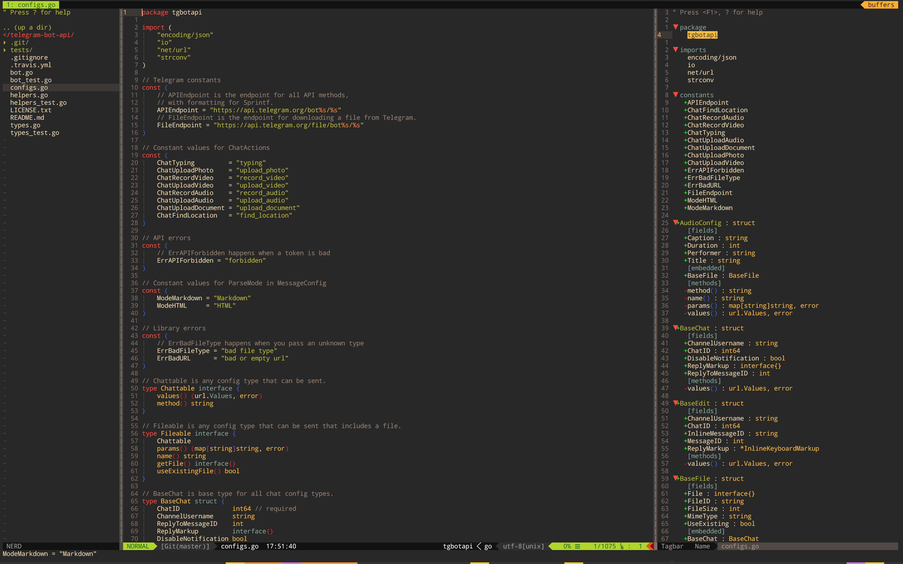

# dotfiles

## Screenshot

## Installation

1. clone the repo
2. enter the folder
3. execute `cp vimrc ~` and `mv ~/vimrc ~/.vimrc`

Some command-line tools may be needed to install, like `the_silver_searcher`
