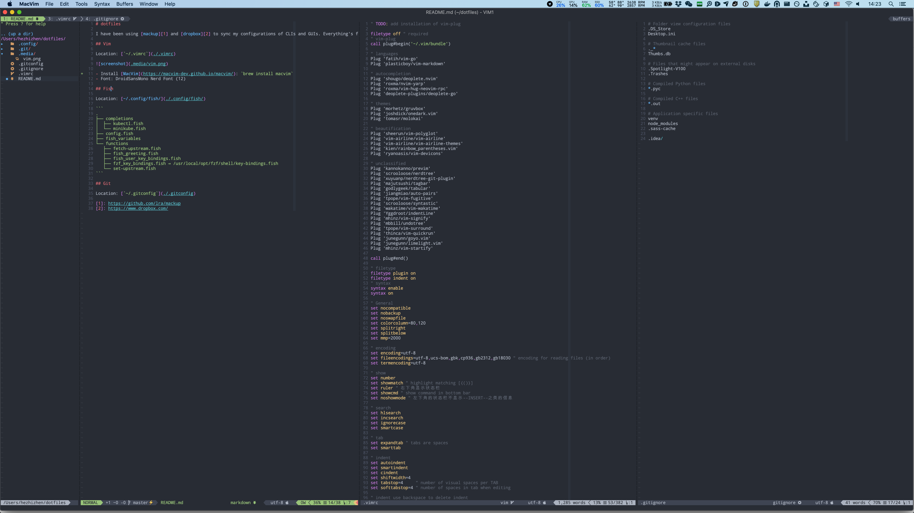
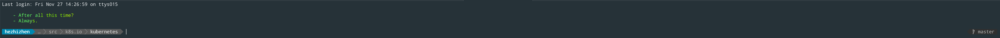

# dotfiles

I have been using [mackup][1] and [dropbox][2] to sync my configurations of CLIs and GUIs. Everything's fine, and I'll keep using them. I just want to save them here as a backup.

## Installation

Credit to @fatih and his [dotfiles][5]

```
# install brew
/bin/bash -c "$(curl -fsSL https://raw.githubusercontent.com/Homebrew/install/HEAD/install.sh)"

# install all brew dependencies
brew bundle

# copy dotfiles to the appropriate places
make

# install vim-plug
curl -fLo ~/.vim/autoload/plug.vim --create-dirs https://raw.githubusercontent.com/junegunn/vim-plug/master/plug.vim

# open vim and install all plugins
:PlugInstall
```

## Screenshots

### vim



### fish



* [starship][3]

[1]: https://github.com/lra/mackup
[2]: https://www.dropbox.com/
[3]: https://starship.rs/
[5]: https://github.com/fatih/dotfiles/
